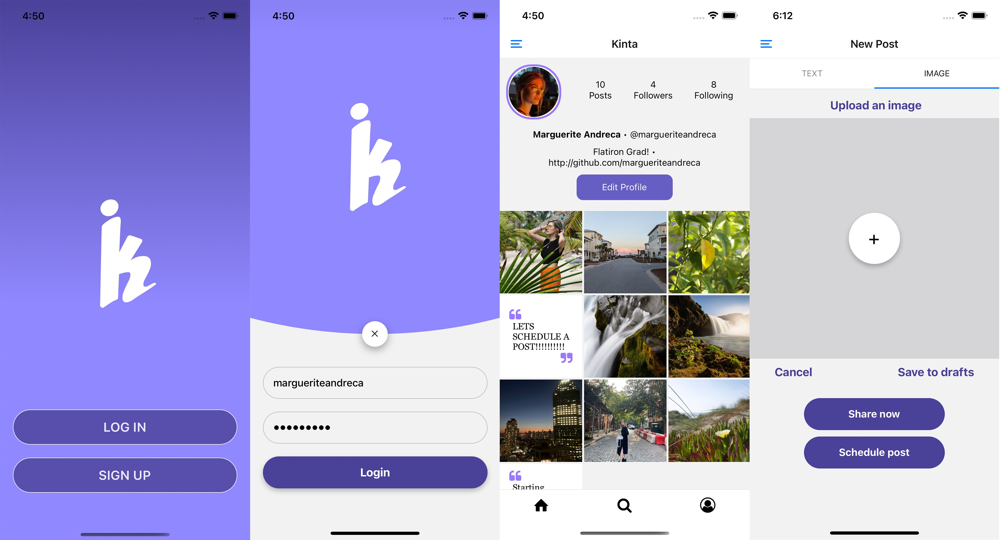

# Kinta | [DEMO](https://www.loom.com/share/8a800d34d0174fca9a4a1f6c2376ca24)

### Mobile Social Media ft. Content Scheduling & Curation 
### [Kinta Back-End Repo](https://github.com/margueriteandreca/CapstoneProjectBE)

## Overview 

I created Kinta as a way for those living busy lives to be able to schedule text and image posts in order to boost their engagement. While studying full time, I noticed that I only had free time to consider what to post in the middle of the night when my posts would go largely unseen. The pressure of interrupting my day to try to post at the right time took much of the enjoyment out of social media, so I set out to create an app that easily organizes drafts and scheduled posts, making it simple to keep track of scheduled posts and the order in which they would appear on my feed. 

*L to R: Kinta's login page, user's own profile, upload screen*

On the Upload Screen, the **TEXT** tab displays a text box, while the **IMAGE** tab displays an Image Picker. Once satisfied, the user can: 

1. Delete
2. Post Immediately
3. Save as a draft
4. Schedule for a later date and/or time

The **SCHEDULE NOW** button brings up a Datetime picker, after which the selected date and time are displayed so that the user may confirm them. 

Users can easily access their drafts and scheduled posts by way of the Side Drawer. Posts are displayed in reverse order, much like how they would appear on the user's own feed, in order to help curate the way their profile will appear. Both drafts and scheduled posts can be edited indefinitely by selecting the post, bring the post back up on the Upload Screen where the user can edit the post, and perform any of the actions listed above.

## Installation 

**To run this application, you will need:**

* [Expo CLI](https://docs.expo.dev/workflow/expo-cli/)
* iOS Simulator

**Instructions:**

1. Clone this repo with `git clone`
2. Change into the directory of this project
3. If needed, follow the above link to install Expo CLI
4. Once in the project directory run `npx expo intall` to install all dependencies needed for the project
5. Run `npx expo start` and wait to load
6. Choose `i` to start the iOS Simulator 

## Techonologies Used:

  &nbsp;
  &nbsp;
  &nbsp;
  &nbsp;
  &nbsp;
  &nbsp;

